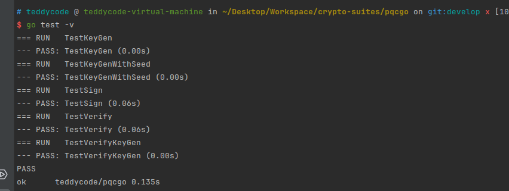
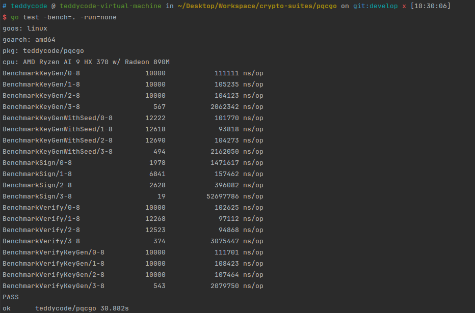

# pqc golang 版

## 说明
如需修改pqcmagic源代码, 请修改`pqcmagic`目录下的源代码, 然后执行以下命令重新编译到多平台库.
-  编译linux库
```shell
cd pqcmagic/build-linux
cmake -DCMAKE_INSTALL_PREFIX=../../libs -DUSE_SM3=OFF -DUSE_SHAKE=ON  -DENABLE_KYBER=OFF -DENABLE_ML_KEM=OFF  -DENABLE_AIG
IS_ENC=OFF -DENABLE_TEST=OFF -DENABLE_BENCH=OFF ..
 make &&  make install

```

- 编译windows库
> 在linux上交叉编译需要安装`mingw-w64`工具链: `sudo apt update   && sudo apt install mingw-w64`
```shell
cd pqcmagic/build-windows
cmake -DCMAKE_INSTALL_PREFIX=../../libs -DUSE_SM3=OFF -DUSE_SHAKE=ON  -DENABLE_KYBER=OFF -DENABLE_ML_KEM=OFF  -DENABLE_AIG
IS_ENC=OFF -DENABLE_TEST=OFF -DENABLE_BENCH=OFF -DCMAKE_TOOLCHAIN_FILE=../toolchain.cmake  ..
 make &&  make install
```
完了会自动将编译好的库文件拷贝到`libs/`目录下.

## 测试结果

